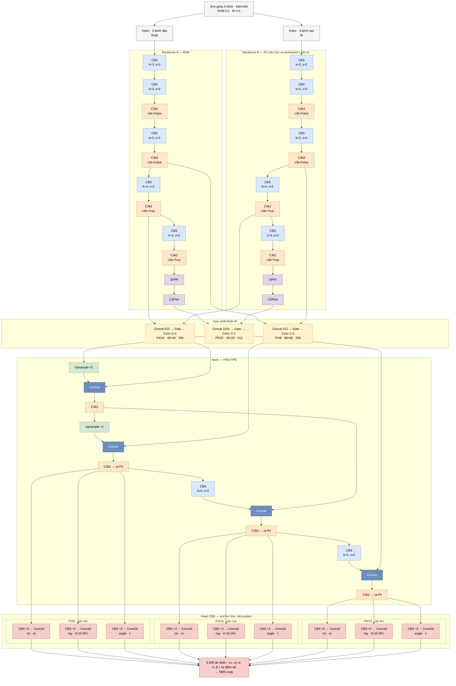
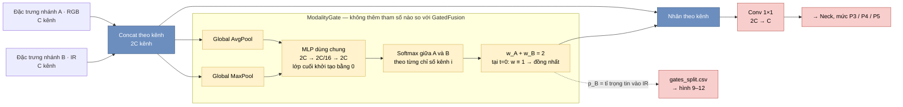
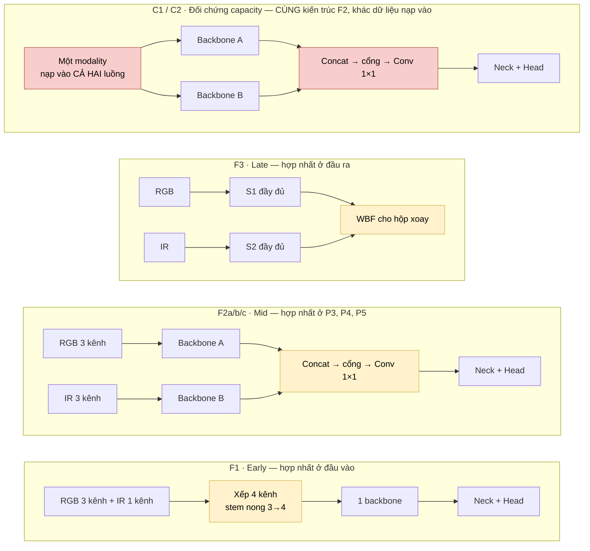

# Sensor Fusion RGB-IR cho phát hiện đối tượng từ UAV

Kiểm chứng **có kiểm soát** giả thuyết: kết hợp RGB + hồng ngoại có thật sự tốt hơn từng cảm biến riêng lẻ không — sau khi đã tách bạch phần đóng góp của *thông tin bổ sung* khỏi phần đóng góp của *mô hình nhiều tham số hơn*.

Kế hoạch đầy đủ: [plan.md](plan.md) · Báo cáo dữ liệu: [DATA_REPORT.md](DATA_REPORT.md)

---

## 1. Ý tưởng cốt lõi

Phần lớn công trình fusion so sánh model hai backbone với model một backbone rồi quy toàn bộ chênh lệch cho fusion. Đó là một confounder: model hai backbone đơn giản là **lớn hơn**.

Đề tài này thêm **nhóm đối chứng capacity**: đúng kiến trúc hai luồng đó, nhưng nạp **cùng một modality vào cả hai luồng**.

| ID | Đầu vào | Kiến trúc | Vai trò |
|---|---|---|---|
| S1 | RGB | 1 luồng | baseline |
| S2 | IR | 1 luồng | baseline |
| **C1** | RGB → cả 2 luồng | 2 luồng | **đối chứng capacity** |
| **C2** | IR → cả 2 luồng | 2 luồng | **đối chứng capacity** |
| F1 | RGB + IR | early, 4 kênh | fusion |
| F2a | RGB + IR | mid, concat+1×1 | fusion |
| F2b | RGB + IR | mid, cổng attention `GatedFusion` | fusion |
| F2c | RGB + IR | mid, cổng modality `ModalityGate` | fusion |
| F3 | RGB + IR | late, WBF từ S1+S2 | fusion |

**So sánh trung thực là `F2a vs C2`, không phải `F2a vs S1`.**

Mỗi biến thể cổng có đối chứng capacity **riêng của nó** — `C1b`/`C2b` cho `GatedFusion`, `C1c`/`C2c` cho `ModalityGate` — nên cặp so sánh đúng là `F2b vs C2b` và `F2c vs C2c`. Chi tiết kiến trúc ở [mục 3](#3-kiến-trúc-model).

C1, C2 và F2a dùng **chung một file kiến trúc** — chỉ khác trường `modalities`. Số tham số bằng nhau tuyệt đối theo cấu trúc, không phải "bằng nhau trong sai số". `tests/test_models.py::test_capacity_control_exact_match` canh bất biến này.

---

## 2. Cách hoạt động

### Xếp chồng kênh thay vì dataloader hai nhánh

Hai modality được xếp thành **một mảng HWC nhiều kênh** ngay tại `load_image`. Toàn bộ pipeline Ultralytics dùng lại nguyên vẹn: Mosaic, LetterBox, RandomPerspective, OBB loss, validator.

Lợi ích quyết định: **augmentation hình học tự động đồng nhất trên mọi kênh**. Rủi ro R4 của plan ("bug phổ biến nhất trong pipeline paired") biến mất về mặt cấu trúc chứ không nhờ ta cẩn thận.

Model tách kênh trở lại thành hai nhánh bằng lớp `Index` ở đầu đồ thị.

```
ảnh 6 kênh ──┬── Index[0:3] ── backbone A ──┐
             │                              ├── Concat → Conv1×1 → neck → OBB head
             └── Index[3:6] ── backbone B ──┘
```

Chi tiết từng khối — backbone, hai loại attention, neck, head — và sơ đồ mermaid cho báo cáo: **mục 3**.

### Ba bản vá vào Ultralytics

Không fork. Chỉ ba điểm, đều idempotent và có test phủ (`src/patches.py`):

1. **`Index` hỗ trợ cắt kênh** — tận dụng nhánh `c2 = args[0]` có sẵn của `parse_model`; giữ nguyên hành vi cũ.
2. **`build_yolo_dataset`** trả về `PairedYOLODataset` khi `data["modalities"]` tồn tại — đi qua `data` nên train và val không thể lệch cấu hình.
3. **Sửa lỗi lấp viền của `RandomPerspective`** — xem mục 6.

---

## 3. Kiến trúc model

Model nền là **YOLO11s-OBB** của Ultralytics. Đề tài giữ nguyên backbone, neck, head và can thiệp đúng **một chỗ**: nhân đôi backbone thành hai luồng rồi chèn khối hợp nhất tại ranh giới *backbone → neck*.

Bốn phần, mỗi phần trả lời một câu hỏi:

| Phần | Câu hỏi nó trả lời | Khối chính |
|---|---|---|
| Backbone | "Trong ảnh có những gì?" | CBS · C3k2 · SPPF · C2PSA |
| **Hợp nhất** (phần của đề tài) | "Lúc này nên tin RGB hay IR?" | Concat → cổng → Conv 1×1 |
| Neck | "Vật to hay nhỏ, nằm ở đâu?" | PAN-FPN: Upsample · Concat · C3k2 |
| Head | "Lớp nào, hộp xoay bao nhiêu độ?" | 3 nhánh conv + DFL + góc |

### 3.1 Backbone — nén ảnh thành đặc trưng

Backbone là một chồng khối làm ảnh **nhỏ dần về không gian, dày dần về kênh**: 640×640×3 → 20×20×512. Đổi lại, mỗi ô ở tầng sâu mô tả một vùng lớn của ảnh bằng ngôn ngữ ngữ nghĩa ("có cái gì đó dài, kim loại, nóng") thay vì bằng pixel.

**CBS** (trong code Ultralytics là `Conv`) = `Conv2d(k=3, s=2)` + BatchNorm + SiLU. Mỗi CBS có `s=2` chia đôi chiều cao/rộng. Năm lần như vậy cho stride 2 → 4 → 8 → 16 → 32.

**C3k2** — khối CSP. Đặc trưng bị tách làm hai nửa theo kênh: một nửa đi thẳng sang đầu ra, nửa kia đi qua `n` khối bottleneck; hai nhánh nối lại rồi qua Conv 1×1. Chỉ một nửa số kênh phải gánh phần tính toán nặng, và nhánh đi thẳng giữ đường gradient ngắn. Cờ `c3k` quyết định bottleneck bên trong:

* `c3k=False` — bottleneck 3×3 thường. Dùng ở tầng nông, nơi độ phân giải còn cao nên mọi thứ phải rẻ.
* `c3k=True` — mỗi bottleneck lại là một khối C3 lồng bên trong. Dùng ở tầng sâu, nơi lưới đã nhỏ nên trả được giá cho dung lượng biểu diễn lớn hơn.

**SPPF** (Spatial Pyramid Pooling – Fast) — cho đặc trưng qua max-pool 5×5 **ba lần nối tiếp**, rồi nối cả bốn phiên bản lại. Pool nối tiếp cho vùng nhìn tương đương 5/9/13 với chi phí gần bằng một lần pooling. Tác dụng thực tế: một neuron ở P5 "nhìn" được gần hết ảnh, nên phân biệt được xe tải với xe con nhờ **ngữ cảnh xung quanh**, không chỉ nhờ các pixel bên trong hộp.

**C2PSA — attention loại 1 (không gian, bên trong từng modality).** Position-Sensitive Attention: trên bản đồ 20×20 của P5, mỗi vị trí được coi là một token và self-attention nhiều đầu cho phép hai vị trí **xa nhau trao đổi thông tin trực tiếp** — việc mà conv 3×3 phải xếp chồng rất nhiều lớp mới làm được. Đây là attention **có sẵn của YOLO11**, không phải đóng góp của đề tài; nó hỏi *"vùng nào trong ảnh đáng chú ý"*.

Backbone xuất ba mức cho neck (số kênh dưới đây là của scale `s`, width 0,5):

| Mức | Lớp gốc | Stride | Lưới ở ảnh 640² | Kênh | Bắt vật cỡ |
|---|---|---|---|---|---|
| P3 | 4 · `C3k2` | 8 | 80×80 | 256 | nhỏ — phần lớn xe trong ảnh UAV |
| P4 | 6 · `C3k2` | 16 | 40×40 | 256 | vừa |
| P5 | 10 · `C2PSA` | 32 | 20×20 | 512 | lớn |

### 3.2 Khối hợp nhất — attention loại 2 (giữa hai modality)

Ảnh vào là mảng 6 kênh đã xếp chồng (mục 2). Lớp `Index` cắt nó thành 3 + 3 kênh cho hai backbone **giống hệt nhau về cấu trúc và cùng nhận một bộ trọng số pretrained**. Hai luồng chạy song song đến P3, P4, P5 rồi mới gặp nhau.

Tại mỗi mức, ba bước:

1. **`Concat`** theo kênh: `[A | B]` → 2C kênh (512 / 512 / 1024).
2. **Cổng** (chỉ F2b, F2c) — nhân mỗi kênh với một trọng số học được, **giữ nguyên 2C kênh**. Giữ nguyên số kênh là chi tiết kỹ thuật quan trọng: nhờ đó `parse_model` suy ra `c2 = ch[f]` vẫn đúng và không cần thêm bản vá nào.
3. **`Conv 1×1`**: 2C → C. Trả lại **đúng số kênh mà neck của YOLO11 chờ đợi**, nên neck và head dùng lại nguyên vẹn, không sửa một dòng.

Chỉ số lớp thật, do `src/models/two_stream.py` sinh ra (biến thể F2c, scale `s`):

```
 1  Index [3, 0, 3]      -> RGB          13  Index [3, 3, 6]    -> IR
 2..12  backbone A                       14..24  backbone B (ban sao)
                                              |
 25 Concat [6, 18]   26 ModalityGate 512   27 Conv 1x1 -> 256   (P3/8)
 28 Concat [8, 20]   29 ModalityGate 512   30 Conv 1x1 -> 256   (P4/16)
 31 Concat [12, 24]  32 ModalityGate 1024  33 Conv 1x1 -> 512   (P5/32)
                                              |
 34..45  neck PAN-FPN goc      46  OBB head tren [39, 42, 45]
```

**`GatedFusion` (F2b) — cổng kiểu Squeeze-and-Excitation.**

* *Squeeze*: global average pool → mỗi kênh còn một con số.
* *Excite*: MLP hai lớp thắt cổ chai (2C → 2C/16 → 2C) + `Sigmoid` → trọng số `w ∈ (0,1)` cho từng kênh.
* *Scale*: `x ← x · w`.

Vì kênh `[0:C)` thuộc RGB và `[C:2C)` thuộc IR, cổng **có thể** học cách hạ RGB xuống khi trời tối. "Có thể" là từ khoá — không có gì trong công thức ép nó làm vậy. Hai điểm yếu, cả hai đều đo được:

1. **Khởi tạo ngẫu nhiên → `Sigmoid` ≈ 0,5.** Ngay lúc vừa nạp pretrained đối xứng, mọi đặc trưng hợp nhất bị co còn một nửa. F2b xuất phát *kém hơn* F2a rồi mới phải học bò lên.
2. **Sigmoid độc lập từng kênh.** `w_RGB` và `w_IR` không ràng buộc nhau: cổng có thể nâng hoặc hạ **cả hai cùng lúc**, tức nó hành xử như bộ chỉnh độ lớn (gain) hơn là bộ *chọn* modality — và con số đọc ra không diễn giải được.

**`ModalityGate` (F2c) — sửa ba điểm, không thêm một tham số nào.**

```python
logits = MLP(avg_pool(x)) + MLP(max_pool(x))      # dung CHUNG mot MLP
p      = softmax(logits.view(B, 2, C), dim=1)     # A va B canh tranh theo tung kenh
out    = x * 2 * p                                # w_A + w_B = 2
```

1. **Khởi tạo đồng nhất.** Conv cuối của MLP khởi tạo bằng 0 → `logits = 0` → `p = 0,5` → `2p = 1`: tại epoch 0 cổng **đúng bằng hàm đồng nhất**, nên F2c xuất phát *bằng đúng F2a về mặt số học*. Mọi chênh lệch sau đó là do cổng học được, không phải do may rủi khởi tạo.
2. **avg + max, chung một MLP** (kiểu CBAM). Một chiếc xe còn ấm trên nền lạnh trong ảnh IR là một **đỉnh cục bộ**; trung bình toàn cục bôi mất nó, max giữ lại.
3. **Softmax giữa hai modality.** Kênh `i` của A cạnh tranh trực tiếp với kênh `i` của B. Ghép cặp theo chỉ số kênh **có nghĩa** vì hai nhánh khởi đầu từ cùng một bộ trọng số pretrained — kênh `i` của hai bên lúc đầu đúng là cùng một bộ lọc. Hệ quả quan trọng: `p[:, 1]` đọc được thành **"tỉ trọng model tin vào IR"**, 0,5 là trung lập, >0,5 là nghiêng về IR.

Chính con số đó được ghi ra `gates_{split}.csv` khi đánh giá (harness bật `ModalityGate.record`) và sinh ra bốn hình 9–12: cổng **có thật sự** nghiêng về IR khi trời tối không, hay nó chỉ là tham số thừa. Đó là khác biệt giữa "fusion tốt hơn" và "biết *vì sao* fusion tốt hơn".

> ⚠️ `GatedFusion` **không được sửa**. Các run F2b/C2b đã train dùng nó, mà harness thì dựng lại model từ config rồi nạp `state_dict`: đổi `forward` nhưng giữ nguyên tên tham số sẽ nạp "thành công" trong im lặng và chạy một hàm khác.

Số tham số (nc = 5, scale `s`) — đọc trực tiếp từ model đã dựng:

| Cấu hình | Tham số |
|---|---|
| S1 / S2 — một luồng | 9.715.906 |
| F1 — early fusion 4 kênh | 9.716.194 *(+288 ở stem do kênh thứ tư)* |
| C1 / C2 / F2a | 15.946.370 |
| C1b / C2b / F2b **và** C1c / C2c / F2c | 16.145.154 |

Fusion và đối chứng capacity của nó bằng nhau **tuyệt đối**, vì cùng một hàm sinh kiến trúc tạo ra cả hai; F2b và F2c cũng bằng nhau vì `ModalityGate` cố ý giữ đúng hình dạng MLP của `GatedFusion`.

### 3.3 Neck — PAN-FPN, trộn thông tin giữa các tỉ lệ

Backbone để lại một mâu thuẫn: P5 giàu ngữ nghĩa nhưng mất vị trí chính xác (một ô = 32 px), P3 sắc về vị trí nhưng nghèo ngữ nghĩa. Neck trộn hai chiều:

* **Top-down (FPN)** — P5 → Upsample ×2 → Concat với P4 → C3k2 → Upsample ×2 → Concat với P3 → C3k2. Ngữ nghĩa chảy **từ tầng sâu xuống tầng nông**.
* **Bottom-up (PAN)** — từ P3 vừa được làm giàu: CBS `s=2` → Concat → C3k2 (ra P4), rồi CBS `s=2` → Concat → C3k2 (ra P5). Thông tin vị trí chảy **ngược lên**.

Kết quả: cả ba bản đồ đều vừa biết "cái gì" vừa biết "ở đâu". Với ảnh UAV — phần lớn đối tượng chỉ vài chục pixel — nhánh P3 gánh gần hết công việc, nên việc hợp nhất RGB-IR **cũng phải xảy ra ở P3**, không chỉ ở P5.

Đáng chú ý cho fusion: neck nhận đầu vào từ ba lớp *đã hợp nhất*, nên nó hoàn toàn không biết model có hai luồng.

### 3.4 Head — OBB, anchor-free, decoupled

Mỗi mức P có head riêng với ba nhánh tách biệt (*decoupled*: phân loại và hồi quy không phải giành chung một bộ đặc trưng):

| Nhánh | Kiến trúc | Đầu ra cho mỗi ô lưới |
|---|---|---|
| cls | `DWConv 3×3 + Conv 1×1` ×2 → `Conv2d` | `nc` logit (DroneVehicle: 5 lớp) |
| reg | `CBS 3×3` ×2 → `Conv2d` | 64 = 4 cạnh × 16 bin (DFL) |
| angle | `CBS 3×3` ×2 → `Conv2d` | 1 |

**Anchor-free** — mỗi ô tự dự đoán khoảng cách từ tâm ô tới bốn cạnh (l, t, r, b); không có anchor box định sẵn, không phải chỉnh k-means cho dữ liệu mới.

**DFL (Distribution Focal Loss)** — thay vì hồi quy thẳng một số thực cho mỗi cạnh, head xuất **phân phối xác suất trên 16 mức rời rạc** rồi lấy kỳ vọng. Model nói được "cạnh này ở khoảng 4,2 ô, nhưng tôi không chắc" — đúng tình huống biên mờ của ảnh IR.

**Góc** — `θ = (sigmoid(a) − 0,25)·π`, tức `θ ∈ [−π/4, 3π/4)`. Một khoảng dài π là đủ vì hộp xoay 180° chính là nó.

Ghép lại, mỗi ô cho `(cx, cy, w, h, θ)` + `nc` điểm số; ở ảnh 640² có 80² + 40² + 20² = **8.400 ô**.

**Gán nhãn và loss** — `TaskAlignedAssigner` chọn ô dương theo điểm kết hợp `cls × IoU`; loss = BCE (cls) + DFL (cạnh) + **ProbIoU** (hộp xoay). ProbIoU coi mỗi hộp là một Gaussian 2D nên khả vi — hoàn toàn hợp lý để **huấn luyện**. Nhưng nó lạc quan có hệ thống nên đề tài **không dùng nó để đo**: xem mục 6.2.

### 3.5 Sơ đồ khối để đưa vào báo cáo

#### Sơ đồ 1 — Toàn hệ thống (biến thể F2b/F2c: two-stream + cổng chú ý)



#### Sơ đồ 2 — Bên trong khối hợp nhất (`ModalityGate`, F2c)



#### Sơ đồ 3 — Ba chỗ có thể hợp nhất (F1 / F2 / F3) và nhóm đối chứng



> Ba sơ đồ trên dựng trực tiếp từ YAML mà `src/models/two_stream.py` sinh ra. Muốn kiểm chứng lại chỉ số lớp: `python -c "from src.models.two_stream import build_two_stream_yaml as b; print(b(fusion='mgate')['backbone'])"`.

---

## 4. Bắt đầu

```bash
# --- dữ liệu (một lần) ---------------------------------------------------
python scripts/prepare_dronevehicle.py      # 28.400 cặp, YOLO-OBB
python scripts/prepare_vedai.py             # 1.246 cặp, 10 fold
python scripts/compute_illum_features.py
python scripts/label_illumination.py        # phân tầng RQ3
python scripts/make_yolo_views.py           # view hardlink cho Ultralytics
python scripts/smoke_test_data.py           # phải PASS

# --- cổng G0: test phải xanh trước mọi training run ----------------------
python -m pytest -q

# --- kiểm thử tích hợp rẻ trước khi tốn GPU ------------------------------
python scripts/smoke_pipeline.py --epochs 3

# --- ma trận thí nghiệm --------------------------------------------------
python scripts/run_matrix.py --dataset vedai --folds 01 03 05
python scripts/run_matrix.py --dataset dronevehicle --seeds 0 1

# --- đánh giá ------------------------------------------------------------
python scripts/evaluate_run.py --run runs/dronevehicle/F2a_seed0 --split test \
    --illum data/dronevehicle/meta/test_illum.csv

python scripts/run_late_fusion.py --s1 runs/dronevehicle/S1_seed0 \
    --s2 runs/dronevehicle/S2_seed0 --out runs/dronevehicle/F3_seed0

python scripts/run_rq4_ablation.py --runs runs/dronevehicle/F1_seed0 \
    runs/dronevehicle/F2a_seed0 --deltas 0 2 5 10 20

python scripts/make_tables.py --project runs/dronevehicle --split test \
    --illum data/dronevehicle/meta/test_illum.csv

# --- biểu đồ ------------------------------------------------------------
python scripts/make_figures.py            # 9 hình -> results/figures/ + bảng số liệu
python scripts/make_figures.py --only 1 6 --reuse-effects   # vẽ lại, bỏ qua bootstrap
python scripts/make_report.py             # gộp thành results/report.html tự chứa
```

### Ngắt và chạy lại

Có checkpoint ở **hai mức**, nên ngắt lúc nào cũng chỉ cần chạy lại **đúng lệnh cũ**:

| Mức | Cơ chế | Mất bao nhiêu |
|---|---|---|
| Run | run có `result.json` thì bỏ qua hoàn toàn | 0 |
| Epoch | run dở dang có `weights/last.pt` thì tiếp tục đúng epoch bị ngắt, khôi phục cả optimizer, EMA, lịch learning rate | tối đa 1 epoch |

```bash
python scripts/run_matrix.py --dataset dronevehicle   # Ctrl-C bất cứ lúc nào
python scripts/run_matrix.py --dataset dronevehicle   # chạy lại: tiếp tục chỗ cũ
python scripts/run_matrix.py --dataset dronevehicle --no-resume   # ép train lại từ đầu
```

Ultralytics ghi `last.pt` sau **mỗi** epoch (không phụ thuộc `save_period`), nên tối đa chỉ mất một epoch dở.

Kiểm chứng bằng test train thật rồi ngắt bằng tín hiệu: `pytest tests/test_resume.py -m slow`.

---

## 5. Cấu trúc

```
configs/
├── base.yaml                  # siêu tham số dùng chung — mọi khác biệt phải nằm ở experiments/
├── datasets/                  # 4 view: {dronevehicle,vedai} × {rgb,ir}
└── experiments/               # 8 cấu hình, sinh bởi scripts/gen_experiment_configs.py
src/
├── patches.py                 # 3 bản vá Ultralytics
├── train.py                   # trainer + runner cho một ô ma trận
├── data/paired_dataset.py     # xếp chồng modality, dịch IR cho RQ4
├── models/
│   ├── two_stream.py          # sinh kiến trúc two-stream từ YAML gốc
│   ├── fusion_ops.py          # GatedFusion (F2b), ModalityGate (F2c)
│   └── build.py               # dựng model + nạp pretrained công bằng
├── fusion/wbf_obb.py          # late fusion cho box xoay
├── eval/
│   ├── metrics.py             # mAP OBB, IoU đa giác chính xác
│   ├── stratify.py            # phân tầng chiếu sáng / kích thước / lớp
│   ├── bootstrap.py           # CI ghép cặp theo ảnh, công thức có trọng số
│   └── harness.py             # suy luận + kết xuất + đánh giá phân tầng
└── utils/seed.py              # seed + provenance
tests/                         # 45 test (2 danh dau `slow`: resume)
scripts/                       # chuẩn bị dữ liệu, chạy, đánh giá, tổng hợp
├── make_tables.py             # bảng kết quả + bootstrap CI
├── make_figures.py            # 9 biểu đồ -> results/figures/ (xem README ở đó)
└── make_report.py             # gộp biểu đồ thành một trang HTML tự chứa
```

Mỗi run ghi `provenance.json` (config + hash + phiên bản torch/ultralytics/GPU), `data.yaml`, `result.json`, `preds_*.npz`, `metrics_*.json`. Không có số liệu nào phải đọc từ stdout.

---

## 6. Ba lỗi/khác biệt đã phát hiện khi triển khai

Đây là phần đáng đọc nhất — tất cả đều là loại sai âm thầm, không báo lỗi.

### 6.1 `RandomPerspective` lấp viền khác nhau giữa các nhóm kênh — **lỗi thật, đã sửa**

`cv2.warpAffine(img, M, borderValue=(114,114,114))` — `borderValue` của OpenCV là `Scalar`, tối đa **4 thành phần**. Với ảnh 6 kênh, bốn kênh đầu được lấp 114 còn **kênh 5-6 bị lấp 0**.

Phép biến đổi hình học vẫn đồng nhất (đúng), nhưng vùng viền lộ ra sau khi xoay/co giãn mang giá trị khác nhau giữa hai modality. Hậu quả: model học artefact "viền IR bằng 0", và **đối chứng C1 không còn đối xứng thật sự** — hỏng đúng phần làm nên giá trị của đề tài.

Cách sửa: warp từng nhóm ≤3 kênh bằng cùng ma trận và cùng giá trị viền (`src/patches.py::apply_warp_patch`). Ảnh 3 kênh đi đúng đường code cũ.

Bắt được bởi `tests/test_data.py::test_augment_sync`: nạp cùng một modality vào cả hai luồng, hai nửa phải bằng nhau từng pixel sau augment.

### 6.2 mAP của Ultralytics lạc quan có hệ thống trên OBB

`OBBValidator` khớp box bằng **ProbIoU** — một xấp xỉ khả vi dùng cho *hàm mất mát*. Đo trên cùng bộ dự đoán (`scripts/diag_metrics.py`):

| | mAP50 | mAP50-95 |
|---|---|---|
| IoU đa giác chính xác + khớp theo confidence (COCO) | 0,1585 | 0,0576 |
| IoU chính xác + khớp kiểu Ultralytics | 0,1552 | 0,0571 |
| ProbIoU + khớp theo confidence | 0,1761 | 0,1034 |
| ProbIoU + khớp kiểu Ultralytics | 0,1698 | 0,1014 |
| *Ultralytics báo cáo* | *0,176* | *0,103* |

Thứ tự khớp gần như không ảnh hưởng. **ProbIoU cao hơn IoU thật trung bình +0,13, tối đa +0,26**, và lệch mạnh nhất ở ngưỡng IoU cao — nên mAP50-95 bị thổi phồng gần gấp đôi.

Đề tài **báo cáo theo IoU đa giác chính xác** để so được với baseline công bố (mmrotate/DOTA devkit). Hệ quả phải ghi rõ: số của `model.val()` không so trực tiếp được với bảng kết quả, và sanity check "đối chiếu S2 với ~83% của literature" chỉ hợp lệ khi dùng harness này.

### 6.3 `compute_ap` của Ultralytics dùng `trapz`, không phải chuẩn COCO

Với `trapz`, một dự đoán hoàn hảo duy nhất cho AP = 0,995 chứ không phải 1,0. pycocotools lấy **trung bình 101 giá trị precision đã nội suy** → AP(GT, GT) = 1,0 chính xác. Harness dùng công thức pycocotools; `tests/test_metrics.py::test_map_perfect_prediction` canh điều này.

---

## 7. Vài quyết định thiết kế đáng chú ý

**Pretrained cho mọi cấu hình.** Nếu S1/S2 nạp được `yolo11s-obb.pt` mà two-stream train from scratch thì chênh lệch sẽ bị quy nhầm cho fusion. `src/models/build.py` ánh xạ chỉ số lớp để **cả hai nhánh nhận cùng bộ trọng số**, và nong stem 3→4 kênh cho F1. Độ phủ: 98,9% (single/early), 97,0% (two-stream).

**Bootstrap có trọng số.** Cách ngây thơ tốn ~25 phút cho một phép so sánh trên 8.980 ảnh. Nhận xét rằng ảnh được chọn `c_i` lần chỉ làm mọi phát hiện của nó xuất hiện `c_i` lần với cùng confidence, nên đường cong P-R chỉ cần một `cumsum` có trọng số sau khi sắp xếp toàn cục **một lần**. Kết quả giống hệt, nhanh hơn hai bậc — `tests/test_metrics.py::test_bootstrap_weighted_matches_naive` kiểm chứng sự tương đương.

**`batch=8` cho mọi cấu hình.** Two-stream bs16@640 cần ~7,7GB, không vừa RTX 3060 Ti 8GB. Nếu để single-stream chạy bs16 còn two-stream bs8 thì batch khác nhau đổi cả effective LR lẫn thống kê BatchNorm — và chênh lệch đó bị quy nhầm cho fusion. Dùng `nbs=32` để gradient accumulate về cùng nominal batch.

**Tắt HSV *và* Albumentations cho mọi cấu hình.** Cả hai tự bỏ qua ảnh ≠3 kênh mà không báo lỗi, nghĩa là nhánh 3 kênh được augment màu còn nhánh 4/6 kênh thì không → mất công bằng.

Albumentations nguy hiểm hơn: Ultralytics bật nó **ngầm định chỉ cần package có mặt trong môi trường** (Blur/MedianBlur/ToGray/CLAHE, mỗi cái p=0,01), không phụ thuộc hyp nào. `configs/base.yaml` đặt `augmentations: []` để tắt sạch — đã kiểm chứng 7 phép biến đổi → 0, và `tests/test_data.py::test_colour_augment_disabled_for_all_configs` khoá lại.

**Không chuẩn hoá mean/std (lệch có chủ đích so với plan 6.4).** Mối lo của plan là *dùng chung* thống kê giữa hai modality; với phép chia 255 thì không có thống kê nào được chia sẻ, và BatchNorm ở stem tự học riêng cho từng kênh. Thêm nữa, pretrained YOLO kỳ vọng đầu vào trong [0,1]. Tuỳ chọn `normalize: per_modality` vẫn có sẵn để kiểm chứng lại bằng thực nghiệm.

---

## 8. Trạng thái

`pytest`: **45/45 xanh** (+2 test `slow` cho resume). Pipeline đã chạy thông end-to-end trên VEDAI qua `scripts/smoke_pipeline.py`: train ma trận → đánh giá phân tầng → late fusion WBF → ablation RQ4 → bảng kết quả có khoảng tin cậy.

Ví dụ đầu ra (3 epoch, **chỉ để kiểm chứng lắp ghép — không phải kết quả nghiên cứu**):

```
| so sanh   | delta mAP50 | CI95              | p     | y nghia |
| F2a vs C2 | +5.09       | [+0.56, +10.94]   | 0.027 | co      |
| C2  vs S2 | -7.33       | [-11.58, -3.36]   | 0.007 | co      |
| F2a vs S2 | -2.23       | [-6.97,  +3.23]   | 0.493 | khong   |

RQ4: F2a giữ 76,0% mAP50 khi dịch IR 5px
```

Còn lại là chạy ma trận thật: `run_matrix.py --dataset vedai` rồi `--dataset dronevehicle`.

---

## 9. Môi trường

RTX 3060 Ti 8GB · i5-13600K · 32GB RAM · Python 3.14 · torch 2.11+cu128 · ultralytics 8.4.61

Cài đặt — **torch phải cài riêng trước** để lấy đúng bản CUDA:

```bash
pip install torch==2.11.0 torchvision==0.26.0 --index-url https://download.pytorch.org/whl/cu128
pip install -r requirements.txt
python -c "import torch; print(torch.cuda.is_available(), torch.cuda.get_device_name(0))"
```

`requirements.txt` **cố ý không cài `albumentations`** — xem mục 7.

⚠️ MMRotate **không dùng được** trên môi trường này (mmcv pin torch <2.1, không có wheel cho Python 3.14). Phương án dự phòng của plan cho R1 là đường 6 kênh ở đây, không phải MMRotate.
